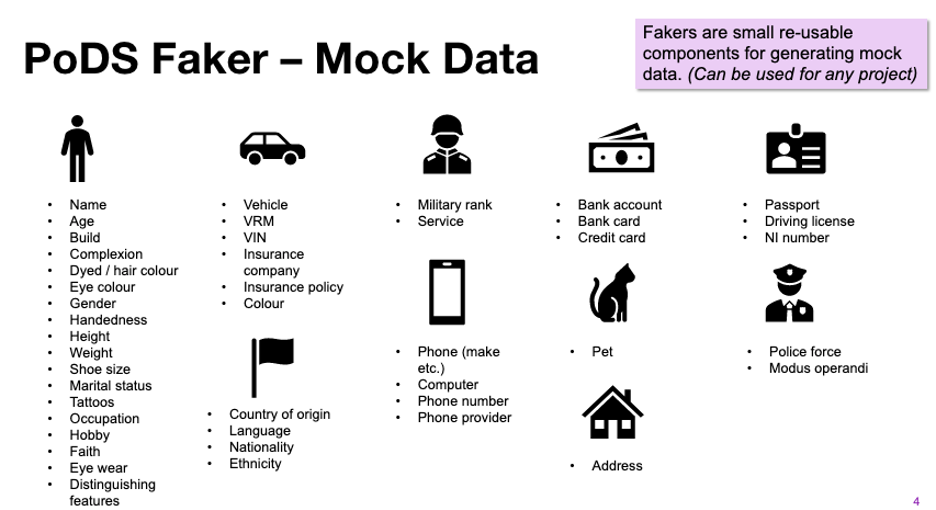

# PythonFakerExtensions

## Background
Faker is a long standing project developed to provide 'mock'data in a number of languages.  

The main project page can be found here: https://pypi.org/project/Faker/

Every provider has a main method that you can use to demostrate the functionality of that provider.

## Our Needs
We wanted to develop a mock data service and chose Faker as a pattern to deliver the general
purpose aspects of mock data generation for the project.  Moving on we have build a number of 
providers which extend the vanilla Faker with more generators.
 
## Notes on Data
All of the data you see in this project is completely open sourced and is included in the references
section below.

### Addresses
All the addresses are real addresses sourced from the land registry via the web site below.
This has the advantage of providing data where the fields are releated, for instance the
postcode and the street name match.  However the telephone numbers are random.

https://www.fakeaddressgenerator.com/UK_Real_Random_Address
 
### Country  and Language Data
The country data is a combination of a number of ISO data sources for country codes
descriptions and most importantly languages spoken in those countries.  There are 
normally anomalies in this data which have been removed by deleting them which
does mean the list if not complete but for the case of mock data this was not deemed
as an important factor. 

https://www.iso.org/iso-3166-country-codes.html
https://www.iso.org/iso-639-language-codes.html

### Crime Types

### Devices
Device data was sourced from the web site below and is based on UK sales data.

https://gs.statcounter.com/vendor-market-share/mobile/united-kingdom/2019

### Financial Institutions
The financial institutions list is a very short extraction of the full list available
in the UK and their short codes.  This list probably needs to be extended.

### Hobbies
Hobbies and their take up in the UK was sourced from Harris Poll data here.

https://theharrispoll.com/wp-content/uploads/2017/12/Harris-Interactive-Poll-Research-Work-Leisure-2007-11.pdf

### Military Postings and Ranks

https://assets.publishing.service.gov.uk/government/uploads/system/uploads/attachment_data/file/866851/1_January_2020_SPS.xlsx
https://en.wikipedia.org/wiki/Royal_Navy_other_rank_insignia

### Occupations
The ONS publishes statistics on occupations.

https://www.ons.gov.uk/employmentandlabourmarket/peopleinwork/employmentandemployeetypes/datasets/employmentbyoccupationemp04

### Vehicles
Vehicle data is interesting.  It is real data which was gathered from an open source roadside survey.  
The file was processed to capture just the information about the vehicle itself.  We used this route because
gathering information about make and models of vehicles, in particular historical
data, is quite difficult as there is no UK body that holds this data.  Such information
is available in the US if needed.

https://data.gov.uk/dataset/52e1e2ab-5687-489b-a4d8-b207cd5d6767/roadside-survey-of-vehicle-observations

### Vehicle Insurance
There are many open sources for this data for instance the one below.
We did not source market percentages.

https://www.finder.com/uk/car-insurance/a-to-z-list

### Police Forces
Again this is easily sourced from the internet.

https://en.wikipedia.org/wiki/Home_Office_radio

## Other Providers
We have a huge number of other providers which are all statistics based
rather than routed in real data items.  All these statistics were sourced from the internet
and can probably be disputed in terms of accuracy. Where possible UK specific statistics were
used.  Note that we have NOT provided any other country specific data at this point.

### Providers with Patterns
Several providers use random data based on a pattern expression.  For instance driving license 
generation of passport numbers.

